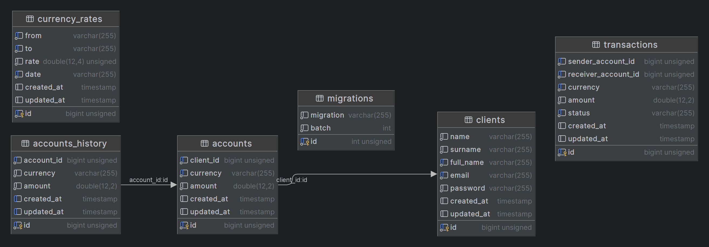

<p align="center"><a href="https://laravel.com" target="_blank"></a></p>

# Fund transfer service

## About

This is Mintos home assignment - fund transfer service. It consists of clients, their accounts, transactions between
accounts and historical currency rates for currency conversions. It has 3 HTTP endpoints.

Application supports these currencies: USD, GBP, EUR,
AUD, NZD, CAD.

Main application lies inside `src` folder, however there are some supportive classes in laravel structure like under
app,database,tests folders.



**Note:**

1. We save currency rates in DB table so we are not dependant on 3rd party software. You can check rate retrieval
   mechanism: ``\src\CurrencyRates\Services\CurrencyConversionService::getRate``
2. We have ``accounts_history`` table to save all changes made to accounts. It makes life a lot easier when we need to
   debug/tell what exact amount customer had at X point in the past

## Project installation

Setup will provide needed guidelines to set up project on you machine. I suggest using Mac/Linux, but commands for
Windows will also be provided

1. Install Git if it is missing https://git-scm.com/book/en/v2/Getting-Started-Installing-Git
2. Install Docker Desktop https://www.docker.com/products/docker-desktop/

For Windows users:

3. Install/Enable WSL2. Laravel docs have pretty good
   explanation -  https://laravel.com/docs/9.x/installation#getting-started-on-windows

Next steps can be done using IDE and terminal (if you use windows than you should use WSL2 and enable it for docker
desktop)

1. Clone project in your selected folder:

```
git clone https://github.com/apk-coding-projects/fund-transfer-service.git
```

Navigate to created fund-transfer-service directory (cloned project directory) and execute following commands from
project root

2. Copy .env.example to create environment file with credentials

```
cp .env.example .env
```

Navigate to [Exchangerate.host](https://exchangerate.host/) and register. Then you can get your API key from dashboard.

3. Copy the key, open .env file and assign the key value to `EXCHANGERATE_API_KEY` variable in .env file

```
EXCHANGERATE_API_KEY=<insert_exchangerate.host_key>
```

### Start the project

1. First, lets follow Laravel guidelines and install
   necessary [dependencies](https://laravel.com/docs/9.x/sail#installing-composer-dependencies-for-existing-projects)

```
docker run --rm \
    -u "$(id -u):$(id -g)" \
    -v "$(pwd):/var/www/html" \
    -w /var/www/html \
    laravelsail/php82-composer:latest \
    composer install --ignore-platform-reqs
```

2. When that finishes successfully, run command to build and run the project

```
./vendor/bin/sail up
```

OR for detached mode

```
./vendor/bin/sail up -d
```

3. To run Laravel commands lets use one of the containers. After this, you will be inside one of the containers, and you
   can run all Laravel commands there

```
docker compose exec laravel.test bash
```

4. Generate laravel app key

```
php artisan key:generate
```

Project should be up and running! Congratulations!
If you want to make sure all is fine - check that docker containers are running, and you can visit
[localhost](http://localhost:8000/) and see Laravel default home page

## Setting up data

If you just started the project, you won't have any data in the database. First you need to run migrations to build
tables:

```
php artisan migrate
```

Now you have the tables without data. If you want to seed the date we have 4 seeders ready for you

1. Will seed only customers table - 15 records. No accounts, no transactions.

```
php artisan db:seed --class=ClientSeeder
```

2. Seeds 50 clients with random amount of accounts.

```
php artisan db:seed --class=ClientsAccountsSeeder
```

3. Seeds 5000 transactions, randomly assigned to accounts

```
php artisan db:seed --class=TransactionSeeder
```

4. Seeds Currency rates for past 15 days. If rates are not seeded, code will use live rates.

```
php artisan db:seed --class=RatesSeeder
```

## API

3 HTTP endpoints were developed according to instructions

1. Getting accounts

```
GET http://localhost/api/clients/{client_id}/accounts
```

2. Getting transaction history

```
GET http://localhost/api/accounts/{account_id}/transactions?offset={offset}&limit={limit}
```

3. Making transactions

```
POST http://localhost/api/transactions
Params: 
senderAccountId
receiverAccountId
amount
currency - as in symbol USD, EUR
```

For example:

```
POST /api/transactions?senderAccountId=198&receiverAccountId=196&amount=100&currency=EUR HTTP/1.1
Host: localhost
```

## Tests

For running tests use

```
docker compose exec laravel.test bash
```

and execute this inside container to run phpunit tests

```
./vendor/bin/phpunit
```

In case you want to generate and check test reports, run:

```
./vendor/bin/phpunit --coverage-html ./reports
```

It will generate reports in the root directory in folder `reports`
